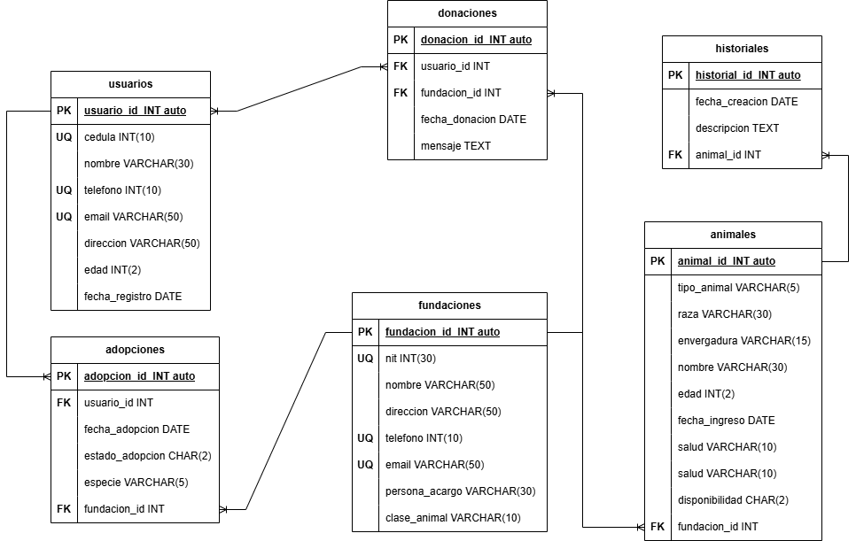

# Proyecto 3068389 (Cuentos con patitas)

## Lista Entidades

### usuarios **(ED)**

- usuario_id INT(10) **(PK)**
- cedula INT(10) **(UQ)**
- nombre VARCHAR(30)
- telefono INT(10) **(UQ)**
- email VARCHAR(50) **(UQ)**
- direccion VARCHAR(50)
- edad INT(2)
- fecha_registro DATE

### animales **(ED)**

- animal_id INT(10) **(PK)**
- tipo_animal VARCHAR(5)
- raza VARCHAR(30)
- envergadura VARCHAR(15)
- nombre VARCHAR(30)
- edad INT(2)
- fecha_ingreso DATE
- salud VARCHAR(10)
- disponibilidad CHAR(2)
- fundacion_id INT(10) **(FK)**

### adopciones **(EP)**

- adopcion_id **(PK)**
- usuario_id INT(10) **(FK)**
- fecha_adopcion DATE
- estado_adopcion CHAR(2)
- especie VARCHAR(5)
- fundacion_id INT(10) **(FK)**

### fundaciones **(ED)**

- fundacion_id INT(10) **(PK)**
- nit INT(30) **(UQ)**
- nombre VARCHAR(50)
- direccion VARCHAR(50)
- telefono INT(10) **(UQ)**
- email VARCHAR(50) **(UQ)**
- persona_acargo VARCHAR(30)
- clase_animal VARCHAR(10)

### donaciones **(ED)**

- donacion_id INT(10) **(PK)**
- usuario_id INT(10) **(FK)**
- fundacion_id INT(10) **(FK)**
- fecha_donacion DATE
- mensaje TEXT

### historiales **(ED)**

- historial_id INT(10) **(PK)**
- fecha_creacion DATE
- descripcion TEXT
- animal_id INT(10) **(FK)**

## Relaciones

1. Un **usuario** realiza muchas **adopciones** (_1 - M_)
1. Muchas **adopciones** realiza una **fundacion** (_M - 1_)
1. Una **funadacion** recibe muchas **donaciones** (_1 - M_)
1. Muchos **usuarios** realizan muchas **donaciones** (_M - N_)
1. Una **fundacion** posee muchos **animales** (_1 - M_)
1. Un **animal** tienen muchas **historias_clinicas** (_1 - M_)

## Diagrama relacional de la BD

## Glosario

- **(PK)** = _Primary Key_
- **(FK)** = _Foreign Key_
- **(UQ)** = _Unique Attribute_
- **(ED)** = _Entidad de datos_
- **(EP)** = _Entidad de pivote_
- **(EC)** = _Entidad de catalogos_
